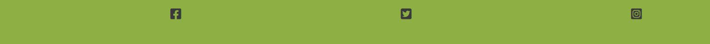

# Laois Arch Club

[Laois Arch Club](https://conal2023.github.io/LaoisArchClub/) is a website for a local organization for adults with intellectual disabilities. The website was set up to help promote such a good organization that I have helped in the past and which a family member is currently still active with their support.

People who visit the page wiLL be able to find out when the next event is, keep up to date via our social links, see the latest photos from recent events, and also contact us.

## Features

- **Navigation Bar**

  - The Navigation bar allows users to freely flow between the 3 pages.
  - With the full responsive Navigation bar users can simply click on the links a navigate around the website.
  - The nav bar is adopted from the Love Running project.
    

- **The Header**

  - The header very simply shows the name of the organization.
    

- **Group Photo image**

  - This photo includes most of our members who recently attended a fundraiser for Laois Arch Club.
  - This photo shows what Laois Arch Club is all about - the members.
    

- **What is Laois Arch Club**

  - This section gives a bit of a background about Laois Arch Club and what exactly they do.
  - Users will be able to see how the organization gains from caring for its members and their families. This should help the organization gain new members and new volunteers.

- **Next Event**

  - This very simply advises anyone who comes and views the page when the next event is on. It also advises on the time and location of the event.
  - This can simply be updated after each event to the next date.
    

- **The Footer**

  - Here links are provided to social network sites which open in a new tab.
  - Users will be able to click on the links and a new tab will open and bring them to the relevant page.
    

- **Gallery**

  - Here users can see some of our recent events and see the work we are doing to help our members and their family.
  - The user will benefit from this section because it will make it simple for them to understand the kinds of events that the organization runs.
    

- **Contact Us**

  - This page allows users to contact Laois Arch Club regarding joining as a member, joining as a volunteer, or finding out about supporting this great cause.
  - The contact form will pop up errors if users don't fill in the required information.
  - The form is just a dummy form and doesn't submit any information.
    

- **Feedback**

  - This page will pop up when a user fills out the contact us form.
  - It is our way of thanking them for taking the time to contact us and showing we appreciate it.
    

## Testing

- I have tested this web page n three different browsers and works on all: Chrome, Edge, and Firefox.
- Device toolbar was also used to see the website through different screen sizes.
- All of the links on the page were tested and confirmed to be responding as they should.
- The contact us form was tested to make sure the fields that required information gave an error, the submit button was tested to confirm it work and also once the submit button was ticked the feedback page responded.

## Bugs

### Solved bugs

- Throughout the project, I had issues where the preview page wouldn't update after I had changed something through CSS even after a hard refresh. The first 2-3 times this happened I found it very frustrating and had to walk away from the PC for a couple of minutes. When I came back Codeanywhere would have signed out and I would have to sign in and open the preview page again. When the page reopened the change would have taken place. After some digging into this through Slack chat I found out this was due to the caches on my browser. Since this whenever a change didn't take effect I would clear the caches first before making sure it wasn't something else.

- Another issue I had was when I put the box around the next event feature. This caused issues with the media feature and would cause the box to pull far to the right away from the rest of the page. This was fixed by changing the units to a percentage rather than a figure. (em, px to %). Once fixed the box appeared correctly under the media request.

### Unsolved bugs

- I am getting a warning regarding my Google Fonts Imports advising me that "Import statements do not load in parallel". Even though I am getting this warning the fonts are still working on the website. Upon investigation through chats with fellow students on Slack, it seems a few students are also having this problem with no one able to find a solution. This will need to be investigated at a later stage.

### Validator Testing

- HTML

  - No errors were returned when passing through the official W3C validator.

- CSS

  - No errors were found when passing through the official (jigsaw) validator.

- Accessibility

  - From running through the lighthouse I confirmed that the colors and fonts chosen are easy to read and accessible.

  - Main Page Lighthouse
    

  - Gallery Page Lighthouse
    

  - Contact Us Page Lighthouse
    

## Deployment

- I deployed the page on GitHub by following the below steps:
  - Open the Setting tab in the project repository.
  - Choose the Pages tab from the menu on the left.
  - Choose the Main Branch from the drop-down option under the Source section, then click Save.
  - When a deployment to Github pages is successful, a notice will be shown with the link to the live page.

You can find the live site here [Laois Arch Club webpage](https://conal2023.github.io/LaoisArchClub/)

## Credits

- The Code Institute Love Running Project had an impact on this project. There may be some similarities in the code but I tried to stray as much as possible away from it.

- The W3Schools.com website helped me a lot when I was struggling to find a way how to do something.

## Media / Content

- The About section and all images were provided by Laois Arch Club for the website. The images would have been taken from their Facebook page which is public and members would have had to opt out of photos taken so no copyrights have been broken.
- The Favicon icon was taken from the website [favicon.io](https://favicon.io/).
- The font for the page came from [Google Font](https://fonts.google.com/).
- The icons used on the page came from [Font Awesome](https://fontawesome.com/)
- The colors ideas came from [ColorSpace](https://mycolor.space/)
